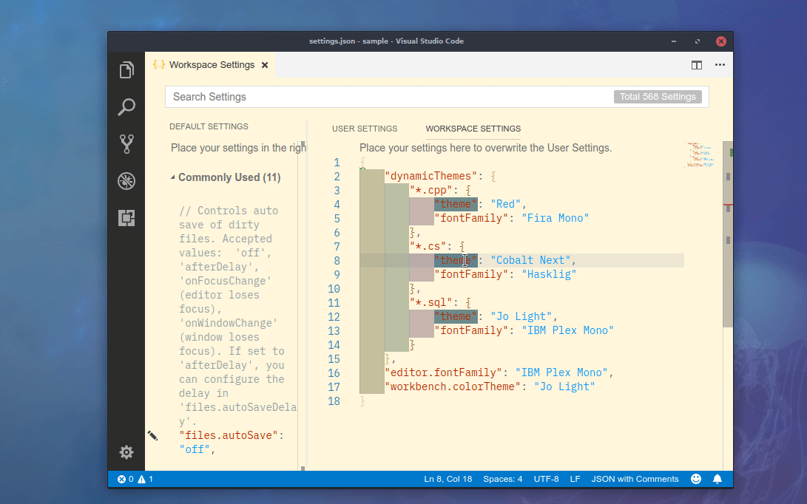

# DynamicThemes
Extension to allow changing font and theme color depending on the active file.

# Features

## Requirements

## Extension Settings
This extension contributes the following settings:

* `dynamicThemes`: sets theme and fontFamily for each file pattern.

## Known Issues
- Currently, there is no way of restore the workspace original theme and font settings after program close.

## Release notes

### 0.0.1
Initial release.
